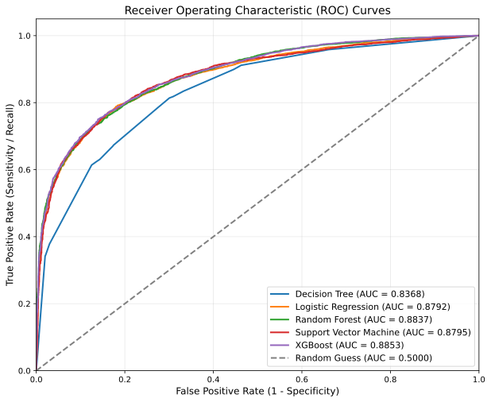
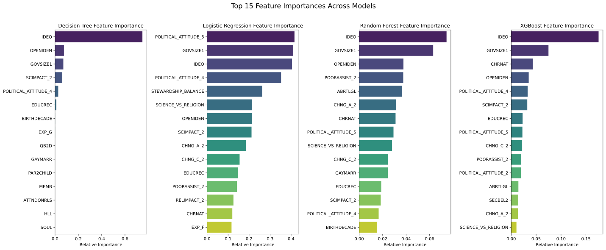

# Predicting Policy Support 
This repository contains a **group project** for a **Data Mining university course**. We predicted support for climate change regulations based on religious beliefs, political attitudes, and socio-demographic variables. The analysis utilizes the Religious Landscape Study 2023-24 by the Pew Research Center, comprising a representative sample of 36,908 U.S. adults. My primary contributions focused on constructing a robust **preprocessing pipeline** and managing **hierarchical survey structures**, **straightlining**, the **stratified train-test split** and **class imbalance**.

## Table of Contents
- [Project Description](#project-description)
- [Project Structure](#project-structure)
- [Installation and Usage Instructions](#installation-and-usage-instructions)
- [Technologies used](#technologies-used)
- [Requirements](#requirements)
- [Project Status](#project-status)

## Project Description
### Topic:
In light of the increasing importance of climate change in political debates, we used multiple classifiers to implement a predictive model of climate change regulation support. The goal was to provide insights into the most important driving features among U.S. adults.

### Dataset:
The data used was provided by the **Pew Research Center** in the context of the **Religious Landscape Study 2023-24**. The dataset includes a representative sample of 36,908 adults and variables about religion and socioeconomic background, while excluding geographic information and several sensitive variables. The variable of interest, QB2C, measured pro- or anti-climate change regulation attitudes.

### Preprocessing
Among our biggest challenges was the construction of a logical preprocessing pipeline that prevents data leakage and allows for adjustment depending on the model (e.g., normalization, feature selection). In addition to planning the pipeline, I addressed the challenges of **hierarchical survey structures** by recoding the variables into their parent variables where possible (see 02_preprocessing.ipynb, chapters 1 & 2) and **straightlining** by identifying mutually exclusive questions and removing participants accordingly (see 02_preprocessing.ipynb, chapter 4). Furthermore, I took responsibility for the **train-test split using stratified sampling** (see 02_preprocessing.ipynb, chapter 7) and addressed **class imbalance using random oversampling** (see 03_modeling.ipynb, chapter 0.3).

### Methods*
We evaluated five classifiers against a majority-vote baseline: **Decision Tree, Random Forest, XGBoost, Logistic Regression, and SVC**. Features were scaled appropriately, and highly correlated features were removed using Spearman correlation. **Hyperparameter optimization** was achieved using 10-fold cross-validation and random search.


### Results*
All applied models significantly outperformed the baseline **macro F1-score**. Furthermore, **feature importances** were evaluated across all models.
    
**Figure 1:** F1 Macro Scores


    
**Figure 2:** Feature Importance scores across models

*The brief overview of the methods and results above highlights the project's main findings to provide context. This should not be misunderstood as solely my work, as my main contributions were focused on the preprocessing pipeline.

## Project Structure
```
Predicting_Policy_Support/
│
├── data/
│   ├── raw/          # Download the dataset manually (see below)
│   └── processed/    # Cleaned data generated by the preprocessing notebook
│
├── notebooks/
│   ├── 01_exploration.ipynb      # For data exploration & class distribution
│   ├── 02_preprocessing.ipynb    # For cleaning, encoding, feature engineering
│   └── 03_modeling.ipynb         # For ML models & evaluation
│
├── results/          # Summary of steps, results and plots
├── requirements.txt  # all Python dependencies for setting up the environment
└── README.md

```

## Installation and Usage Instructions

### 1. Clone the repository
```bash
git clone https://github.com/yamakoshimats/Predicting_Policy_Support.git
cd Predicting_Policy_Support
```

### 2. Set up your Python environment
```bash
python3 -m venv venv
source venv/bin/activate        # Mac/Linux
venv\Scripts\activate           # Windows
pip install -r requirements.txt
```

### 3. Download the dataset manually
The raw data is not stored in this repo due to licensing and file size.

1. Go to: https://www.pewresearch.org/dataset/2023-24-religious-landscape-study-rls-dataset/
2. Register a free Pew Research account and download the dataset (`.sav` file)
3. Place it in: `data/raw/`

### 4. Launch Jupyter
```bash
jupyter notebook
```
### 5. Open and run notebooks
- Exploration of dataset `notebooks/01_exploration.ipynb`.
- Preparing data for analysis `notebooks\02_preprocessing.ipynb`.
- Data analysis `notebooks\03_modeling.ipynb`.


## Technologies used
Key packages:
- `pandas`, `numpy` — data handling
- `pyreadstat` — reading `.sav` SPSS files
- `scikit-learn` — machine learning models
- `matplotlib`, `seaborn` — visualization
- `jupyter` — notebooks


## Requirements:
See `requirements.txt`. 


## Project Status
- **Last Update**: May 2026
- **Status**: Completed
